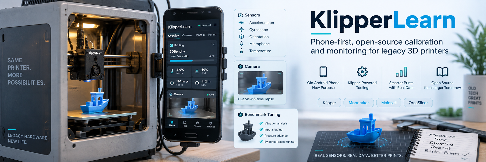
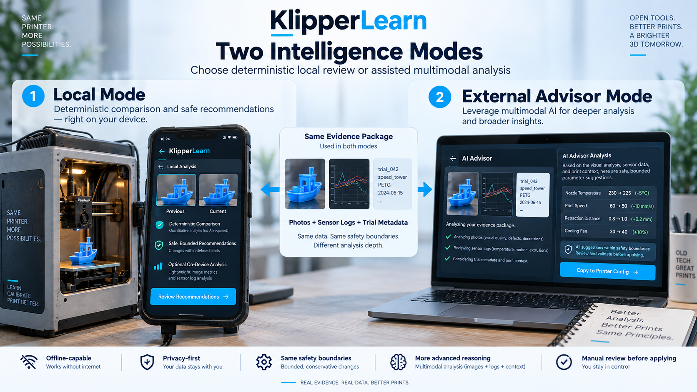
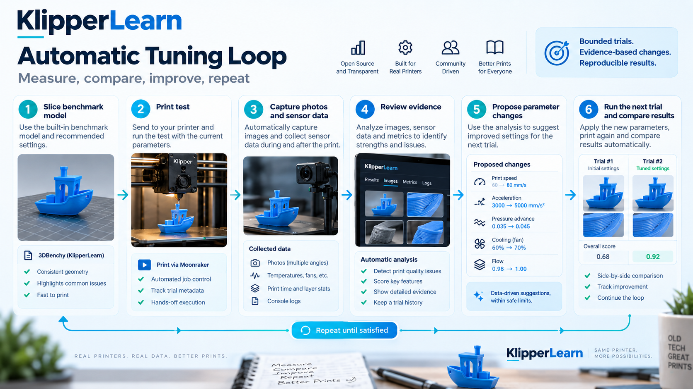
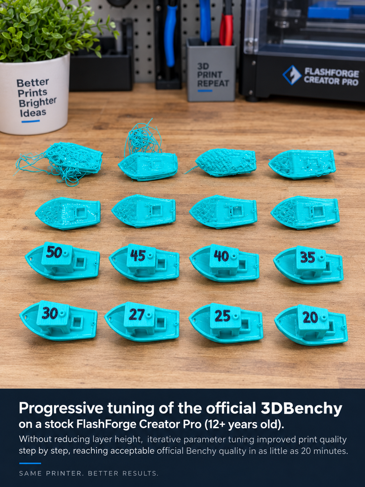
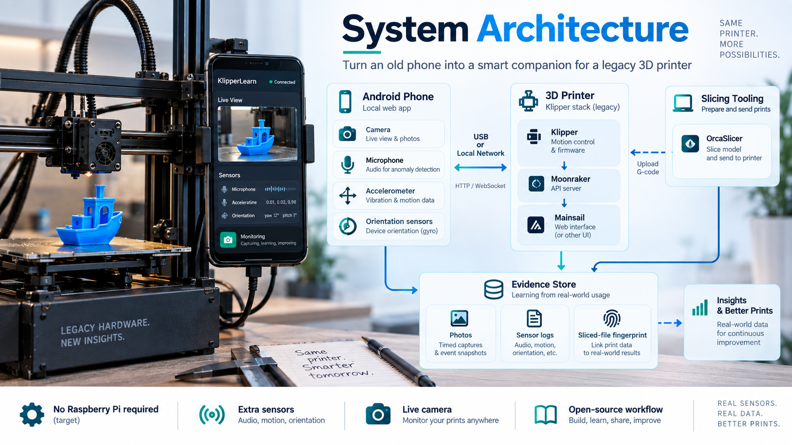

<p align="center"></p>

# KlipperLearn

**Keep the printer. Reuse the phone. Learn from real prints.**

[](https://github.com/Agnuxo1/KlipperLearn/actions/workflows/ci.yml)
[](LICENSE)

KlipperLearn combines a touch-friendly phone interface, local camera and sensor
evidence, reproducible calibration charts, and bounded tuning proposals for
compatible Klipper / Moonraker printers. Its purpose is to make existing machines
more useful rather than require a new printer.

**0.6.0 — file-first Printer Optimizer and optional MCP tools.** This repository now contains the original
Python application and its HTML/JavaScript phone companion, not only the earlier
advisory demonstration. The original installation is not overwritten by this
publication. Read the [capability matrix](docs/STATUS.md) before connecting hardware.

> **Phone-only hosting is a development target, not a delivered Android installer.**
> The shipped deployment uses a Python host running beside Klipper/Moonraker and
> a phone browser as interface, camera and sensor source. An HTML page alone does
> not supply a native Klipper process or reliable USB access. No trained defect
> weights or universally validated automatic calibration profile are bundled.

## Printer Optimizer: phone optional, slicer first

**New in 0.6.0:** a portable [ChatGPT/Codex skill package](plugins/printer-optimizer/)
with a standard-library helper, optional MCP tools, original calibration coupon,
and an authenticated local workflow at `/mobile/optimizer.html`.

Review actual original photos and logs in your selected assistant. Propose one
bounded experiment, repeat it, and export **Quality / Standard / Speed** as three
matching **process + filament** pairs. The implemented native exporter targets
OrcaSlicer; other slicers receive a reviewed settings report, not a fake native
conversion. A phone, printer firmware change and cloud API call are not required
for the file workflow.

Profiles are selected from whole comparable reviewed configurations, with a
quality floor and at least two independent repetitions. Layer height/count,
geometry, infill, supports, temperature and custom G-code are not changed. Missing
evidence blocks output. Multiple modes can legitimately share the same settings.
These are evidence-supported candidates, not universally optimal profiles.

Optional discovery identifies Moonraker/OctoPrint APIs on an explicitly approved
private subnet, with strict scope and time limits. It does not scan Wi-Fi passwords,
guess a printer model, start a print, or expose a private printer to the Internet.
The package is **not yet a registered/approved public ChatGPT plugin**, and native
slicer import and real physical results require separate acceptance tests.

**Free and open source:** no publisher subscription, external account or API key
is required for the file-first plugin. ChatGPT eligibility and usage limits remain
controlled by OpenAI. [Public submission kit and current blocker](submission/README.md).

Read the [slicer workflow](docs/SLICER_OPTIMIZER.md) and
[plugin/MCP connection instructions](docs/CHATGPT_PLUGIN.md).

## Two advisor modes

| Mode | Available now | Deliberate boundary |
| --- | --- | --- |
| **Local learning** | Local evidence storage, registered chart analysis, small ridge-model experiments, bounded parameter proposals, and optional MobileNet training/inference tools. | A fitted model is not proof of general print-quality accuracy. No pretrained defect model is bundled; low-quality or incomplete evidence must be rejected. |
| **External advisor** | An offline HTML reviewer exports a structured request and validates manually returned JSON from ChatGPT or another reviewer. | No cloud account, API key or automatic API call is built in. Returned text is not executable G-code and does not directly control a printer. |


*Concept art: the diagrams describe the project direction, not a validated native-phone deployment.*

Both modes use explicit evidence and bounded proposals. Hardware protection stays
with Klipper and a qualified operator; neither mode may bypass thermal limits,
trusted configuration or confirmation requirements.

## What is in the application

- **Touch console:** printer status, temperatures, file selection, explicit manual
  controls, camera preview, history and human ratings.
- **Phone evidence:** motion, orientation, aggregated acoustic features, a durable
  upload queue, and controlled paired photographs when supported by the device.
  Raw microphone recordings are not saved by the sensor collector.
- **Calibration workflow:** chart generation and geometry checks, immutable file
  hashes, reviewed observations, one-variable proposals, and experimental six-zone
  screening. Specified limits are not a guarantee that a machine can safely reach them.
- **Integrations:** Moonraker APIs, camera registration/proxy interoperability with
  Mainsail, candidate Orca profile exports, and a source-preserving Orca slice manifest.
- **Privacy:** local storage by default, authenticated private routes, bounded request
  bodies, and no publication of the author's private keys, runtime data or old Git history.

## Install and open the console

Use Python **3.11 or newer** on a compatible host. These steps install the application,
not Klipper firmware, a native Android host, or printer-specific configuration.

```sh
git clone https://github.com/Agnuxo1/KlipperLearn.git
cd KlipperLearn
python -m venv .venv
```

Activate the environment with `.venv\Scripts\activate` on Windows or
`source .venv/bin/activate` on Linux, then:

```sh
python -m pip install -e ".[learning]"
python -m klipperlearn serve --host 127.0.0.1 --port 8765
```

Open **http://127.0.0.1:8765/mobile/console.html**. This default invocation does
**not** enable printer control or connect to a printer. For an authenticated phone
connection over HTTPS, follow the complete [installation guide](docs/INSTALLATION.md).
Do not expose Moonraker or this application directly to the public Internet.

**No desktop-PC dependency:** install the Python backend and its private state on
your Linux printer host, enable its system service, and open that host on the phone.
Changing only the Moonraker address does not relocate a Windows backend. Follow
the [Linux deployment and migration guide](docs/LINUX_HOST.md), including HTTPS,
startup, camera-proxy and instance-identity checks.

For the separate, dependency-free external-advisor reviewer:

```sh
python -m http.server 8080 --bind 127.0.0.1 --directory reference
```

Open **http://127.0.0.1:8080**. Its clearly labelled synthetic example is for
software demonstration and is **not a printer profile**. The reference page has
no printer transport and its content security policy disables network API calls.

## The 3D calibration chart



The intended loop is **establish a baseline → collect synchronized evidence →
review → propose one bounded change → run an explicitly approved trial → compare
and repeat or stop**. A failed trial remains useful negative evidence; a `completed`
Moonraker job does not prove dimensional accuracy or acceptable surface quality.

Automatic trial preparation must be explicitly enabled. Starting a new physical
print still requires an explicit request and a clear bed; this release does not
implement robotic bed clearing or a validated unattended safety supervisor.
See the [calibration protocol](docs/CALIBRATION_PROTOCOL.md) and
[local learning guide](docs/LOCAL_LEARNING.md).

## Workshop progress: external-advisor example

<p align="center"></p>

**Attribution:** these Benchy trials were printed on the **Flashforge Creator Pro**
with operator adjustments advised by **ChatGPT**, **not by KlipperLearn**. The
**Anycubic 4Max Pro** is the separate KlipperLearn + phone + webcam installation,
using our charts and the Anycubic calibration cube. These are distinct machines,
benchmarks and workflows; see [benchmark provenance](docs/BENCHMARK_PROVENANCE.md).

*The artwork shows the author-reported tuning progression and is not an independent
quality measurement. A subsequent review of the available printer history found
a fastest identifiable completed, non-partial Benchy entry of **22 min 17 s print
duration** (**25 min 35 s total duration**), recorded with **0.4 mm layers and 121
layers**. Other trials use different layer heights and counts. Printing a
full-height model is not the same as preserving a fixed layer count or complying
with a standardized benchmark protocol. The image is AI-retouched editorial artwork;
its approximately 20-minute label must not be treated as the exact logged result.
The [original source-photo pixels](assets/benchy-workshop-original.png) and
[image provenance notes](assets/README.md) are available separately. Raw private
histories are not published, and these times do not establish visual quality.*

## Architecture and integration



The current application separates the phone browser, Python companion, Moonraker,
Klipper host, and printer MCU. Keep those roles distinct when reporting results.
See [architecture](docs/ARCHITECTURE.md), [Android host requirements](docs/ANDROID_HOST.md),
[integration boundaries](docs/INTEGRATIONS.md), [model documentation](docs/MODEL_CARD.md),
[safety](docs/SAFETY.md), and [privacy](docs/PRIVACY.md).

These are **external integrations**, not changes accepted by Klipper, Moonraker,
Mainsail, OrcaSlicer or Voron. Contributions should solve a concrete problem and
follow the relevant project's process; see [community collaboration](docs/COMMUNITY.md).

## Development and validation

```sh
python -m pip install -e ".[learning,dev]"
npm ci
python tools/run_offline_tests.py
node scripts/run-node-tests.cjs
node --test tests/core.test.js
python -m unittest discover -s tools/exporter/tests -v
python tools/check_repository.py
```

Browser tests require Playwright Chromium: run `npx playwright install chromium`.
On Windows an already installed Edge can be selected with
`KL_TEST_BROWSER_CHANNEL=msedge`. All browser printer endpoints are simulated;
software tests never prove hardware safety. Details and measured results are in
[validation](docs/VALIDATION.md) and the [0.5.1 review](docs/RELEASE_REVIEW_0.5.1.md).

## License, provenance and attribution

The imported application is **GPL-3.0-or-later**; see [LICENSE](LICENSE) and
[COPYING](COPYING). The separately published 0.1.0 reference reviewer and integration
tools retain their MIT license in [LICENSES/MIT-reference.txt](LICENSES/MIT-reference.txt).
Third-party notices and the included Klipper logo are documented in
[THIRD_PARTY_NOTICES.md](THIRD_PARTY_NOTICES.md).

Created by **Francisco Angulo de Lafuente** and KlipperLearn contributors.
Independent project: no upstream affiliation, endorsement or hardware certification
is implied. [Source-import provenance](docs/SOURCE_IMPORT.md) explains what was
imported, revised, excluded and preserved privately.

## Open-source ecosystem integrations

The [ten-project integration workstream](integrations/ecosystem/README.md) tracks
external adapters, contribution rules, tests and upstream acceptance separately.
A [PrusaSlicer post-processing setup](integrations/prusaslicer/README.md) reuses
the existing read-only fingerprint helper. This is interoperability maintained
here, not a claim that external projects have bundled or endorsed KlipperLearn.

## Ten-project interoperability toolkit

KlipperLearn now provides project-specific external artifacts for **Klipper,
Moonraker, OrcaSlicer, Mainsail, Fluidd, OctoPrint, PrusaSlicer, Cura, KIAUH and
Voron**. This is interoperability work in our repository, not a claim that those
ten projects accepted or included KlipperLearn.

Start with the [downloadable packages](integrations/packages/README.md) or the
[project-by-project status and validation](integrations/ecosystem/README.md).
The tools preserve printer/workflow provenance, avoid modifying G-code and make
native-GUI, hardware and maintainer acceptance explicit rather than assumed.
